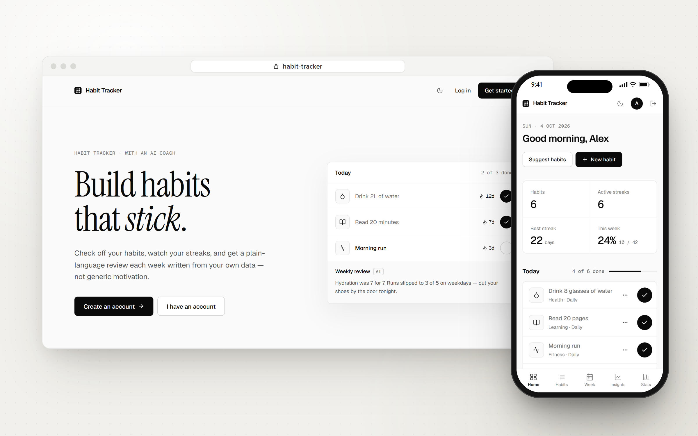
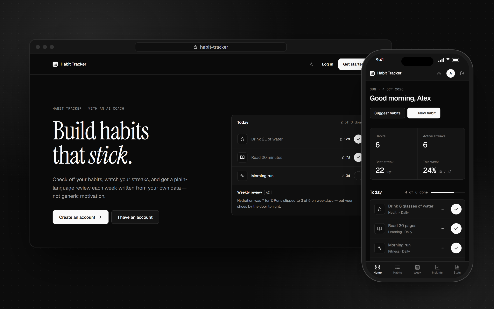

# Habit Tracker

A clean, ad-free habit tracker with an AI coach. Built with React, Express and MongoDB.



<details>
<summary>Dark mode</summary>



</details>

## Why I made it

I built this in my third year of university. I was trying to get rid of some bad habits, and tracking them daily was the only way I could see if I was actually making progress. The habit apps I tried were full of ads and distractions, so I made my own.

The first version was just a frontend with a simple design. It ran in my browser, saved everything locally, and was only meant for me. Later I added a backend with accounts, a database and AI features, which turned it into the full-stack app it is now.

## Features

- Check off habits each day and keep your streaks going
- 90-day heatmap and a weekly grid to see how consistent you've been
- Stats for this week by day, this week vs last week, by category, and 7/30-day trends
- AI features using Google Gemini:
  - a weekly review of what went well and what slipped
  - habit suggestions based on a few questions about your goals
  - a short recovery plan when you break a streak
  - a chat where you can ask questions about your own data
  - an optional morning note
- Light and dark mode, works on mobile
- Accounts with JWT login and bcrypt-hashed passwords

## Tech stack

- **Frontend:** React 19, Vite, Tailwind CSS 4, React Router, Axios, date-fns, Lucide icons
- **Backend:** Node.js, Express, MongoDB (Mongoose), JWT, bcrypt
- **AI:** Google Gemini (`@google/genai`)

## Running it locally

You'll need Node.js 20+, a MongoDB database (local or a free [Atlas](https://www.mongodb.com/atlas) cluster), and optionally a [Gemini API key](https://aistudio.google.com/apikey). Without the key the app still works, just without the AI features.

```bash
git clone https://github.com/mazharsourav/Habit-Tracker.git
cd Habit-Tracker
```

**Backend**

```bash
cd backend
npm install
cp .env.example .env    # fill in your own values
npm run dev             # http://localhost:8000
```

| Variable         | What it's for |
| ---------------- | ------------- |
| `PORT`           | API port (default `8000`) |
| `MONGO_URI`      | MongoDB connection string |
| `JWT_SECRET`     | Long random string for signing login tokens |
| `JWT_EXPIRES_IN` | How long a login lasts, e.g. `30d` |
| `GEMINI_API_KEY` | Gemini API key (leave empty to turn AI off) |
| `GEMINI_MODEL`   | Gemini model (default `gemini-2.5-flash`) |
| `CLIENT_URL`     | Frontend URL(s) allowed by CORS, comma-separated |

**Frontend** (in a second terminal)

```bash
cd frontend/habit-tracker
npm install
cp .env.example .env    # VITE_API_URL=http://localhost:8000/api
npm run dev             # http://localhost:5173
```

Then open http://localhost:5173 and sign up.

Other scripts: `npm start` in the backend runs it without auto-reload, and in the frontend you have `npm run build`, `npm run preview` and `npm run lint`.

## Project structure

```
backend/
  config/        MongoDB connection
  controllers/   auth, habits, logs, AI
  middleware/    JWT auth, error handling
  models/        Mongoose schemas
  routes/
  utils/         date helpers, Gemini client
  server.js
frontend/habit-tracker/
  src/
    api/         Axios instance
    components/
    context/     auth and theme
    pages/
    utils/
```

## License

MIT. See [LICENSE](LICENSE).
